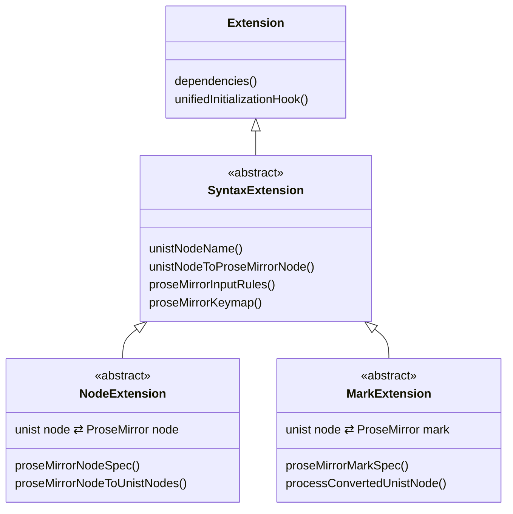
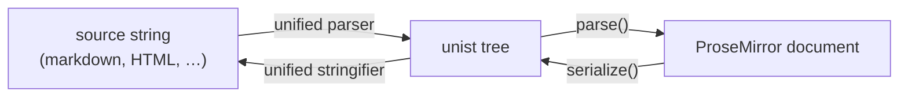
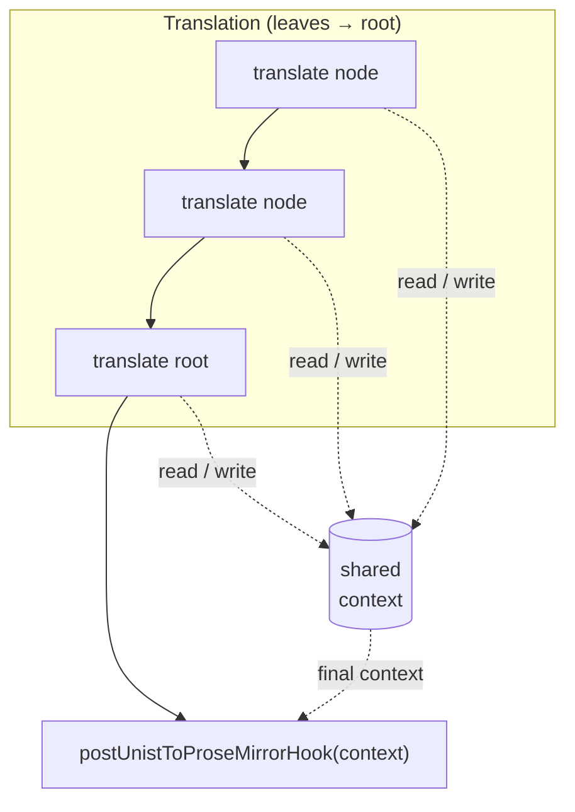
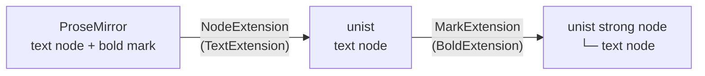

# Overview

This section is for people **building support for a new syntax** — one that doesn't already have a prosemirror-unified extension. If you just want to edit markdown, you want [prosemirror-remark](https://github.com/marekdedic/prosemirror-remark) and the [Guide](/guide/introduction) instead.

prosemirror-unified doesn't aim to extend unified itself. To support a syntax you either take an existing unified plugin (such as remark for markdown or rehype for HTML) or write your own, and then use prosemirror-unified to translate between the unified syntax tree and the ProseMirror document.

## unist and ProseMirror

Documents in unified are represented as an abstract syntax tree of nodes, called [unist](https://github.com/syntax-tree/unist), starting from a root node for the whole document. ProseMirror works much the same way, with one important difference: ProseMirror has a concept of **marks** that can be applied to a node.

Bold text is the classic example. In ProseMirror it is a text node carrying a bold *mark*. In unist there are no marks — bold text is a `strong` *node* that contains a text node.

To bridge this difference, prosemirror-unified provides two basic kinds of extension:

- A [**`NodeExtension`**](/developing/extensions#nodeextension) translates between a unist node and a ProseMirror node — a paragraph, for example.
- A [**`MarkExtension`**](/developing/extensions#markextension) translates between a unist node and a ProseMirror mark — bold text, for example.

Both translate in both directions. Shared machinery between them lives in the abstract [`SyntaxExtension`](/developing/extensions#syntaxextension) class, and the root of the whole hierarchy is the [`Extension`](/developing/extensions#extension) class:

## The two directions

Parsing and serializing are mirror images of each other. unified turns your source string into a unist tree and back; prosemirror-unified translates between that unist tree and a ProseMirror document:

## Translating from unist to ProseMirror

When parsing, prosemirror-unified traverses the unist tree and builds a matching ProseMirror tree from the leaves up to the root. For each node it checks every extension to find one that can translate that node — at most one should match, and if several do, the first is used and a warning is logged. The node's children are translated first, so that when a node is finally translated it can incorporate its already-prepared children.

Some extensions need to add information only once the whole document is parsed. For that there is a global **context** object that any extension can modify while translating, plus a **post-translation hook** that runs after the tree is complete:

The context is a single object shared across every extension for the whole document, so an extension can stash information while translating one node and use it while translating another. The post-translation hook then runs once, after the entire tree is built, giving extensions a chance to act on the fully-populated context.

## Translating from ProseMirror to unist

Serializing is the mirror image. prosemirror-unified traverses the ProseMirror tree from the leaves up, and for each node finds the one `NodeExtension` that can translate it (again, at most one should match). Children are translated first.

Marks are handled afterwards: if the original ProseMirror node carried any marks, each one is matched to a `MarkExtension`, whose `processConvertedUnistNode` post-processes the already-translated unist node. A node carrying several marks is post-processed once per mark, each `MarkExtension` receiving the result of the previous one; the order in which multiple marks are processed is not guaranteed.

### Example

Bold text is a text node with a bold mark in ProseMirror. Serializing it to unist first calls a `NodeExtension` (say a `TextExtension`) to produce a unist text node. That node is then post-processed by a `BoldExtension` (a `MarkExtension`), which wraps it into a unist `strong` node containing the original text node:

## Next steps

Continue to the [Extension API](/developing/extensions) for the full class hierarchy and every method you can override.
